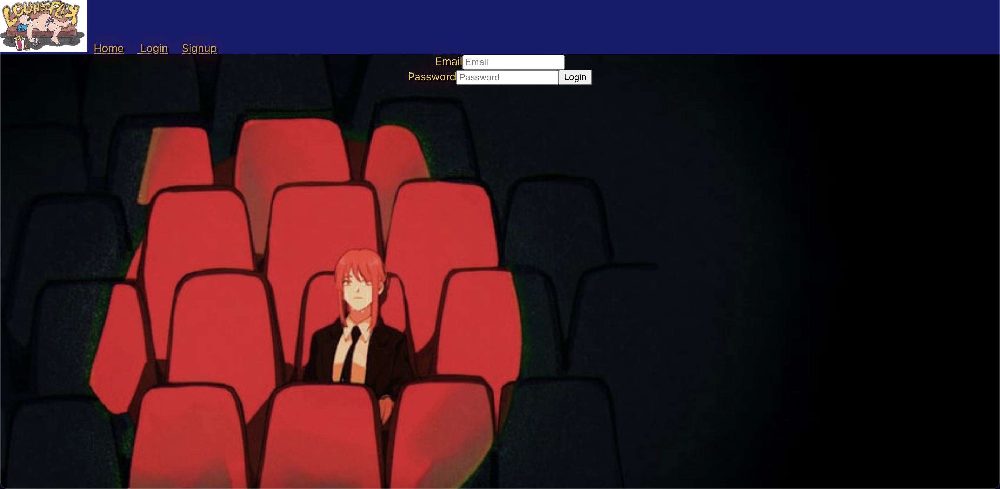
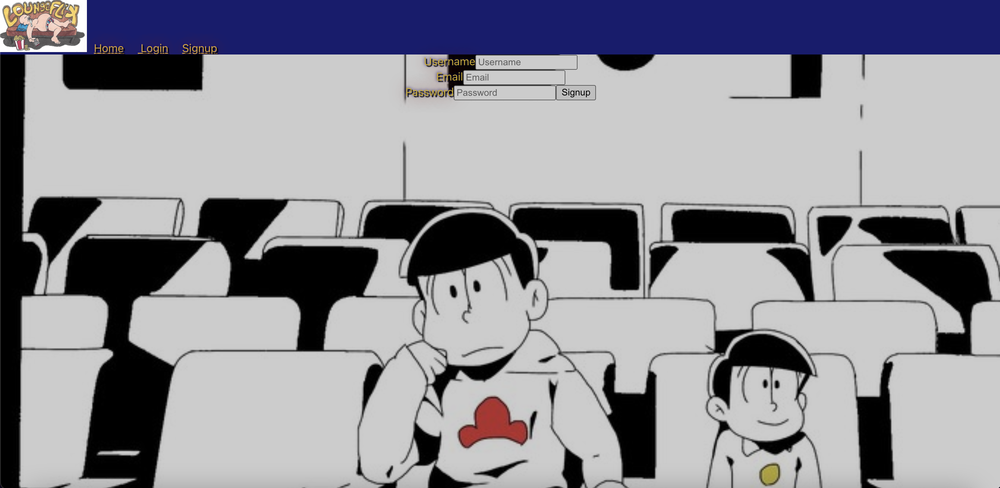
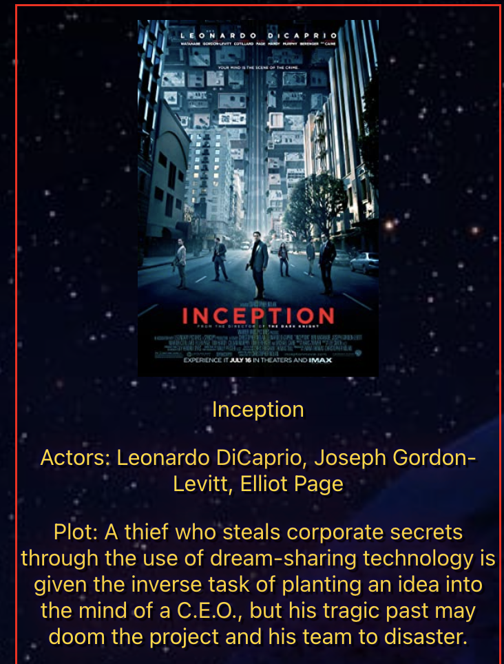
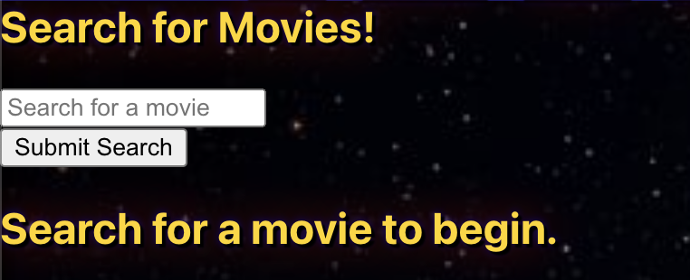
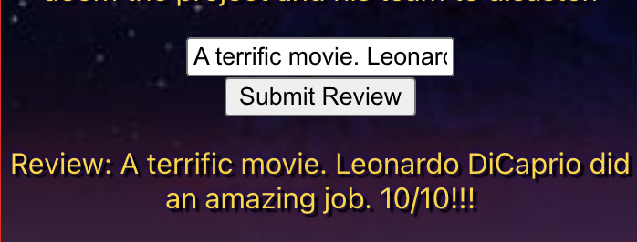
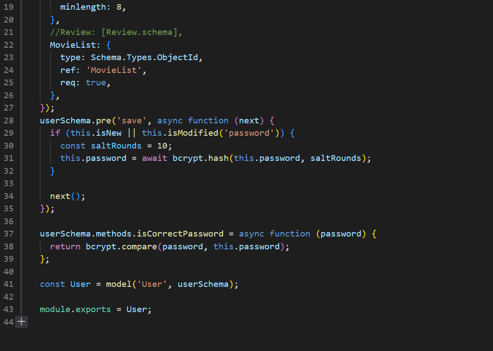
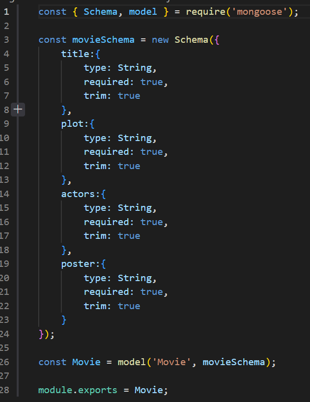
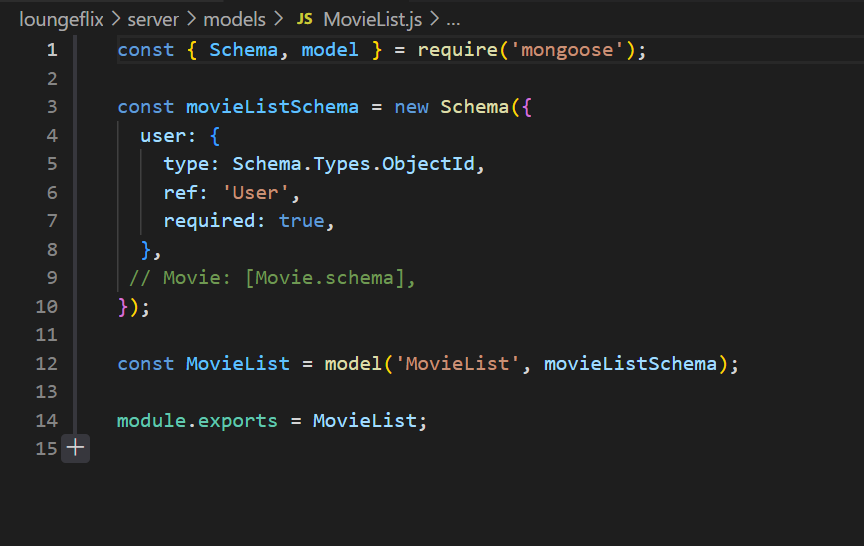
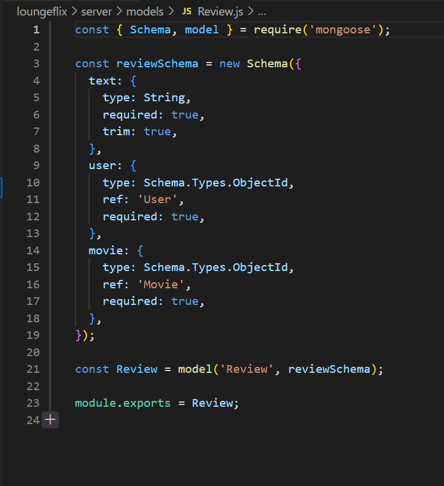
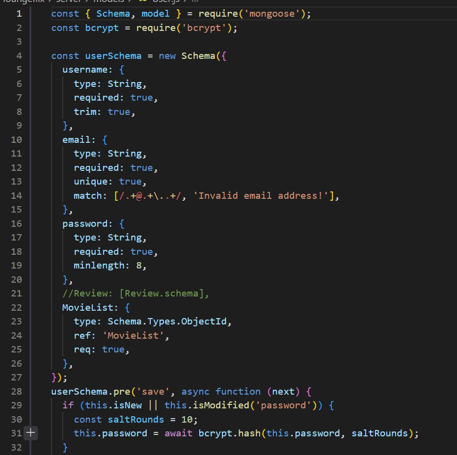

# loungeflix
## Table of Contents
* [Authors](#authors)
* [Description](#description)
* [Links](#links)
* [License](#license)
* [Technologies](#technologies)
* [User Story](#user-story)
* [Features](#features)
* [Code Snippets](#code-snippets)
* [Models](#models)


## Authors

1) Vasu Apparao [LinkedIn](https://www.linkedin.com/in/vasu-apparao-312b1513b/)/[GitHub](https://github.com/Elduderino23)
2) Alexis Zaragoza: [LinkedIn](https://www.linkedin.com/in/alexis-zaragoza-5baa51242/)/[GitHub](https://github.com/turtle2001)
3) Allen Klein: [LinkedIn](https://www.linkedin.com/in/allen-klein-506031251/)/[GitHub](https://github.com/allen-ek)
4) Danial Mirza: [LinkedIn](https://www.linkedin.com/in/danial-mirza-2860a0206/)/[GitHub](https://github.com/danialmirza99)

## Description
Movie review social site where friends and people can connect and see what others have to say about their favorite movies.
Using React for the front end React-Bootstrap for the styling and MongoDB for the backend. As well as express and GraphQL to handle requests and responses. 

## Links

[Heroku Deployed Application Link](https://safe-lake-57742.herokuapp.com/)

[Github Repository Link](https://github.com/danialmirza99/loungeflix)


## License


[](https://opensource.org/licenses/MIT)


## Technologies

### FrontEnd

- React
- React Bootstrap

### BackEnd

- Node.Js
- MongoDB
- Express
- GraphQL
- Apollo


## User Story

| As a         | I want                            | So that   
| ------------ | ------------------------------------ | ------------    |
| `User` | A page that can allow me to sign up or login to the application | ` I can login or sign up to see my profile` |
| `User` | To be able to search for a movie by name | `I can either find a specific movie that I already know` |
| `User` | To be able to write a review on a movie | `I can provide feedback on the movie and showcase my opinion` |
| `User` | To be able to search for movies by genres | `I can narrow down my search for a movie` |
| `User` | A navbar that can allow me to jump from section to section or page to page  | `I can save time and have an easier time navigating through the application` |

## Features

1) Allows new visitors to sign up



2) Allow users to login and logout of the application



3) Navbar that allows users to jump around the application


4) Movie Card that displays the details of the movie



5) Search Bar that allows users to search for a movie



6) Review Form that allows users to post a review




## Code Snippets

### Signup:
#### The code snippet below allows for the user to signup and if doesn't match password requirement or username is taken alerts the user.
```javascript
const Signup = () => {
  const [formState, setFormState] = useState({
    username: '',
    email: '',
    password: '',
  });
  const [addUser, { error, data }] = useMutation(ADD_USER);
  const handleChange = (event) => {
    const { name, value } = event.target;

    setFormState({
      ...formState,
      [name]: value,
    });
  };

  const handleFormSubmit = async (event) => {
    event.preventDefault();
    console.log(formState);

    try {
      const { data } = await addUser({
        variables: { ...formState },
      });

      Auth.login(data.addUser.token);
    } catch (e) {
      console.error(e);
    }
  };

  return (
    <section style={styles.signUpStyles}>
      <Form onSubmit={handleFormSubmit}>
        <Form.Group style = {styles.formStyles} controlId='formBasicUsername'>
          <Col >
            Username
          </Col>
          <Col sm={10}>
            <Form.Control
              type='username'
              placeholder='Username'
              value={formState.username}
              name='username'
              onChange={handleChange} />
          </Col>
        </Form.Group>

        <Form.Group style = {styles.formStyles} controlId='formBasicEmail'>
          <Col >
            Email
          </Col>
          <Col sm={10}>
            <Form.Control
              type='email'
              placeholder='Email'
              name='email'
              value={formState.email}
              onChange={handleChange} />
          </Col>
        </Form.Group>

        <Form.Group style = {styles.formStyles} controlId='formBasicPassword'>
          <Col >
            Password
          </Col>
          <Col sm={10}>
            <Form.Control
              type='password'
              placeholder='Password'
              name='password'
              value={formState.password}
              onChange={handleChange} />
          </Col>
          <Button style = {styles.formStyles} type='submit'>
          Signup
        </Button>
        </Form.Group>

      </Form>
    </section>
  );
};
export default Signup;
```

### Movie Search Render:
#### The code snippet below is the code to search a movie with the OMDB movie api and render it onto the page using React.
```javascript
 const Home = () => {
  const [searchedMovies, setSearchedMovies] = useState({});
  const [searchInput, setSearchInput] = useState('');
  const [reviewShow, setReview] = useState(true)
  const [reviewInput, setReviewInput] = useState('')

  const handleFormSubmit = async (event) => {
    event.preventDefault();

    if (!searchInput)
      return false;

    fetch(`https://www.omdbapi.com/?t=${searchInput}&apikey=`)
      .then(result => result.json())
      .then(result => {
        setSearchedMovies({ title: result.Title, actors: result.Actors, plot: result.Plot, poster: result.Poster })
      })
    setSearchInput('');
    setReviewInput('');
    setReview(true);
  };

  const handleReviewSubmit = (event) => {
    event.preventDefault();
    setReview(false)
  }

  return (
    <section style={styles.sectionStyles}>
      <Jumbotron fluid className='text-light bg-dark'>
        <Jumbotron fluid className='text-light bg-dark'>
          <Container>
            <h1>Search for Movies!</h1>
            <Form onSubmit={handleFormSubmit}>
              <Form.Row>
                <Col xs={12} md={8}>
                  <Form.Control
                    name='searchInput'
                    value={searchInput}
                    onChange={(e) => setSearchInput(e.target.value)}
                    type='text'
                    size='lg'
                    placeholder='Search for a movie'
                  />
                </Col>
                <Col xs={12} md={4}>
                  <Button type='submit' variant='success' size='lg'>
                    Submit Search
                  </Button>
                </Col>
              </Form.Row>
            </Form>
          </Container>
        </Jumbotron>

        <Container>
          <h2>
            {searchedMovies.title
              ? `Viewing results for ${searchedMovies.title}`
              : 'Search for a movie to begin.'}
          </h2>
          <CardColumns>
            {!searchedMovies.title
              ? null
              : <section>
                <Card style={styles.cardStyles}>
                  <Card.Img variant='top' src={searchedMovies.poster} style={styles.imgStyle} />
                  <Card.Body>
                    <Card.Title>{searchedMovies.title}</Card.Title>
                    <Card.Text>
                      Actors: {searchedMovies.actors}
                    </Card.Text>
                    <Card.Text>
                      Plot: {searchedMovies.plot}
                    </Card.Text>
                    <Form onSubmit={handleReviewSubmit}>
                      {reviewShow
                        ? <Form.Row>
                          <Col xs={12} md={8}>
                            <Form.Control
                              name='reviewInput'
                              value={reviewInput}
                              onChange={(e) => { setReviewInput(e.target.value) }}
                              type='text'
                              size='lg'
                              placeholder='Add your review here.'
                            />
                          </Col>
                          <Col xs={12} md={4}>
                            <Button type='submit' variant='success' size='lg'>
                              Submit Review
                            </Button>
                          </Col>
                        </Form.Row>
                        : null
                      }
                    </Form>
                    <Card.Text>
                      Review: {reviewInput}
                    </Card.Text>
                  </Card.Body>
                </Card>
              </section>
            }
          </CardColumns>
        </Container>
      </Jumbotron>
    </section>
  );
};

export default Home;
```

### Client Side Login:
#### The code snippet below allows for the clientside to login through thier bowser to the server.
```javascript
export const LOGIN_USER = gql`
  mutation login($email: String!, $password: String!) {
    login(email: $email, password: $password) {
      token
      user {
        _id
        username
      }
    }
  }
`;
```

### Backend Server Signup:
#### The code snippet below sends a post request to add a user to the MongoDB database.
```javascript
  Mutation: {
    addUser: async (parent, { username, email, password }) => {
      const user = await User.create({ username, email, password });
      const token = signToken(user);
      return { token, user };
    },
```


## Models

### User Model



### Movie Model



### Movie List Model



### Review Model



### User Schema


